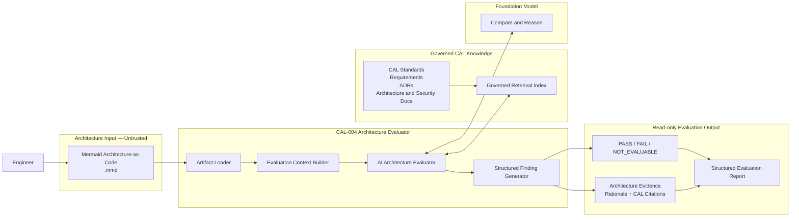
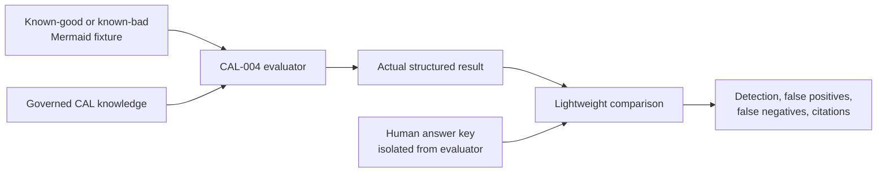

# Architecture

## Overview

CAL-004 combines three components with distinct responsibilities:

| Component | Question answered | Role |
|---|---|---|
| Mermaid architecture | What exists? | Untrusted engineering evidence |
| Governed CAL knowledge | What should exist? | Authoritative requirements and decisions |
| Foundation model | How do they compare? | Constrained reasoning engine |
| Structured findings | Where do they conform or differ? | Auditable evaluation output |

## Logical architecture

The diagram is logical rather than a commitment to a particular cloud deployment. CAL-003 mechanisms such as an Amazon Bedrock Knowledge Base, S3-backed vector storage, and a Bedrock foundation model may be reused, but CAL-004 documentation does not expand the project into infrastructure implementation.

## Component responsibilities

### Artifact loader

Accepts one Mermaid source file, validates that it can be treated as supported input, and exposes its declared elements and relationships as evidence. It does not render images, execute directives, or modify the file.

### Evaluation context builder

Keeps evaluator policy, governed sources, and untrusted artifact content distinct. It requests relevant CAL knowledge and preserves source authority and citation metadata. It must not include fixture answer keys.

### AI architecture evaluator

Compares observed evidence with retrieved authoritative requirements. It selects a status, explains the comparison, and classifies failure impact. It does not propose a target state.

### Structured finding generator

Produces stable machine-readable records for human review and lightweight validation. Formatting does not change the substance or severity of a finding.

### Governed retrieval

Returns relevant CAL passages with source identity and authority. Retrieval relevance is necessary but not sufficient; the evaluator must determine whether a source is authoritative for the condition.

## Validation architecture

The planned test arrangement is separate from the evaluator:

The fixture and answer-key files shown here are proposed, not yet implemented. See [validation.md](validation.md) for examples and review gates.

## Data flow and trust

1. An engineer supplies Mermaid source.
2. The loader treats the complete artifact as untrusted data.
3. The context builder retrieves applicable governed CAL sources.
4. The model compares evidence and requirements under evaluator policy.
5. The formatter emits cited findings to a result destination.
6. During validation only, a separate human process compares results with isolated expected findings.

There is no data flow from findings into architecture, code generation, Terraform, Git, or cloud deployment.
